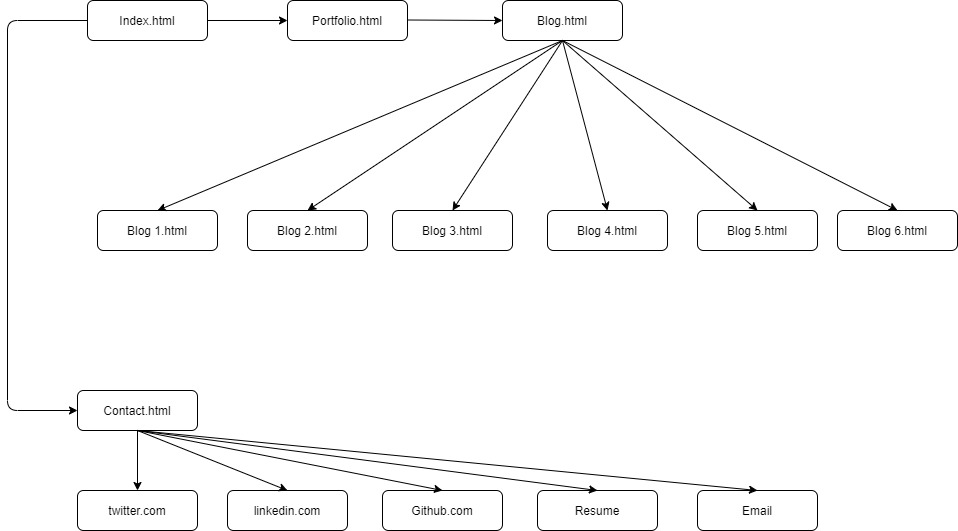

#Statement of Purpose and Scope
• The Purpose of this Portfolio is to do demostrate the knowledge of HTML and CSS for any user that is interested or any future employer since this is can be the base for your starter portfolio. 

-----------------------------------------------------------------------------------

#Features
User will be able to access my portfolio that contain my portfolios, my blogs, and my contact details

-----------------------------------------------------------------------------------

#Site Map

-----------------------------------------------------------------------------------

#Screenshots
 
 
 

-----------------------------------------------------------------------------------

#Target Audience
• The targe audience could be anyone really, but most importantly this is to show your future employer.

-----------------------------------------------------------------------------------

#Tech stack
• Using HTML and CSS to created this portfolio.